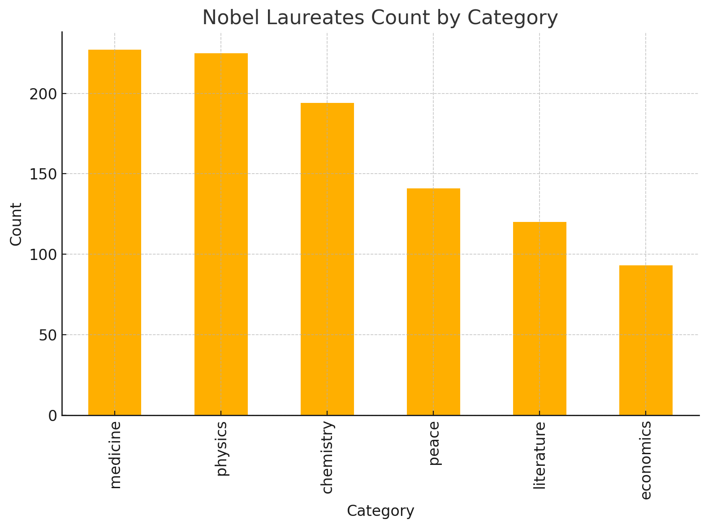
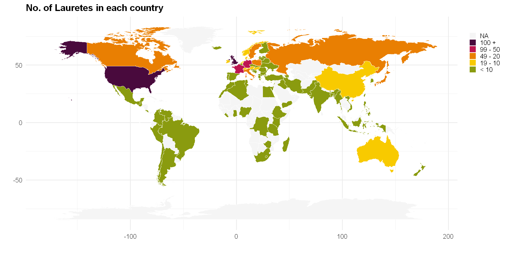

# Project of Data Visualization (COM-480)

| Student's name | SCIPER |
| -------------- | ------ |
| Tianle Chu | 389730 |
| Yuchen Ouyang | 388166 |
| Jingxuan Sun | 390244 |

[Milestone 1](#milestone-1) • [Milestone 2](#milestone-2) • [Milestone 3](#milestone-3)

## Milestone 1 (21st March, 5pm)

**10% of the final grade**

### Dataset

We are going to utilize the [Nobel Prize Winners: 1901 to 2023](https://www.kaggle.com/datasets/sazidthe1/nobel-prize-data) dataset from Kaggle for our analysis and visualization, which was retrieved from the Nobel Foundation's Nobel Prize Data (<https://www.nobelprize.org/prizes>). Between 1901 and 2023, the Nobel Prizes and the Sveriges Riks bank Prize in Economic Sciences in Memory of Alfred Nobel were awarded 621 times to 1,000 people and organizations. With some receiving the Nobel Prize more than once, this makes a total of 965 individuals and 27 organizations.

Information about the dataset:

- file format: `.csv`, single table
- 16 attributes for each tuple, including `year`, `category`, `laureateID`, `fullName` and others.
- 965 individuals and 27 organizations in total
- already cleaned and directly usable
- Details about variable encoding and names can be found in the accompanying Nobel Prize Data csv file

### Problematic

The Nobel Prize, established in 1895, is one of the most prestigious recognitions awarded to individuals and organizations for exceptional contributions to various fields such as Physics, Chemistry, Medicine, Literature, and Peace. Despite the extensive data available about Nobel laureates, there is a lack of accessible, comprehensive, and visually engaging representations that analyze the geographic distribution and institutional affiliations of these winners over time. This gap limits the ability to understand how certain regions and institutions contribute disproportionately to global advancements and recognition in these fields.

Our project aims to address this gap by developing an **interactive visualization tool that maps the nationality, birthplaces, and institutional affiliations of Nobel Prize winners** from the inception of the prize to the present. By presenting this data in a dynamic, scrollable, and categorized format, we intend to offer a multifaceted view of the Nobel Prize landscape. Users will be able to explore the data year by year, observe trends in different award categories, and compare the representation of countries and institutions over time.

Additionally, the project aims to provide an aggregated summary view to present broader patterns and insights. This approach can help answer questions such as: Which countries have consistently produced Nobel laureates? Are there specific institutions that are frequently associated with Nobel-winning research? How have geopolitical changes influenced the distribution of Nobel Prizes over time?

The lack of such an accessible, visual representation can hinder educational institutions, researchers, and policymakers from gaining insights into the global distribution of intellectual achievements. Therefore, our project seeks to contribute to a better understanding of the historical and geographical dimensions of global intellectual contributions recognized by the Nobel Prize.

**Task Structure**:

1. Interactive global map with winner information for each country.
2. Offer users with yearly configuration panel.
3. Offer users with category selection panel.
4. Offer a static summary view for the broader patterns.

### Exploratory Data Analysis

**1. Missing Values and Special Considerations**
 We conducted an analysis of the missing values in the dataset. It is important to note that the Nobel Peace Prize category exhibits missing values for the country of birth. This occurs because, in some cases, the laureate is not an individual but an organization. As a result, the absence of the country information is directly relevant to our analysis, whereas missing values in other attributes are less critical.

**2. Award Distribution Insights**
 The Nobel Prize in Economic Sciences was only introduced in 1969. Consequently, the number of laureates in this category is significantly lower compared to the other prize categories. The differences in award counts among the other categories are illustrated in the figure below.

**3. Interesting Insights**

- **Spatial Distribution:**
   As illustrated in the figure below, recipients with U.S. nationality far outnumber those from other countries.

- **Temporal Trends:**
   Our distribution line plot, which includes an approximated trend line, clearly shows that the average prize share has increased over time. This trend reflects a shift in the scientific paradigm towards greater collaboration, which is essential for driving innovation across experimental fields. Notably, this observation aligns with the collaborative spirit that motivated this course.

### Related work

Several studies and visualizations have explored the Nobel Prize dataset, examining trends in laureate demographics, prize distribution, and interdisciplinary collaborations. The [Nobel Foundation](https://www.nobelprize.org/prizes/) provides an extensive historical archive of laureates, categorizing winners by year, discipline, and nationality. Additionally, the [Open Data Soft](https://public.opendatasoft.com/explore/dataset/nobel-prize-laureates/table/?disjunctive.category) platform presents the dataset in an interactive table format, allowing users to filter laureates by category, birth country, and award year. The platform also offers basic visualizations, such as bar charts and maps, to highlight geographic distributions and historical trends. However, these representations remain relatively static and do not deeply explore temporal shifts or interdisciplinary connections.

Our approach is original in that it aims to synthesize multiple dimensions of Nobel Prize trends into a cohesive visual narrative. While prior analyses have often focused on one specific trend, we integrate multiple perspectives using innovative visualizations that make complex patterns more accessible. We plan to explore prize-sharing trends over time, interdisciplinary connections between scientific fields, and the migration backgrounds of laureates, providing a more comprehensive understanding of the evolving nature of scientific recognition.

Our visual inspiration comes from various sources beyond Nobel Prize studies. For example, [New York Times](https://www.nytimes.com) and [Our World in Data](https://ourworldindata.org) provide excellent models for structuring historical data in a visually compelling manner.

This project builds upon previous explorations of the dataset in [MATH-517](https://edu.epfl.ch/coursebook/fr/statistical-computation-and-visualisation-MATH-517). The previous analyses primarily focused on statistical modeling or algorithmic approaches. In contrast, this submission for the data visualization course prioritizes storytelling and exploratory analysis. Rather than using predictive modeling or hypothesis testing, we emphasize intuitive visual representations that uncover historical shifts and scientific paradigms.

## Milestone 2 (18th April, 5pm)

**10% of the final grade**

<<<<<<< HEAD
Link to website: https://com-480-data-visualization.github.io/momo/

Link to report:
=======
[Link to website](https://com-480-data-visualization.github.io/momo/)

[Link to report](https://github.com/com-480-data-visualization/momo/blob/milestone2/Milestone%202.pdf)
>>>>>>> milestone2

## Milestone 3 (30th May, 5pm)

**80% of the final grade**

## Late policy

- < 24h: 80% of the grade for the milestone
- < 48h: 70% of the grade for the milestone
